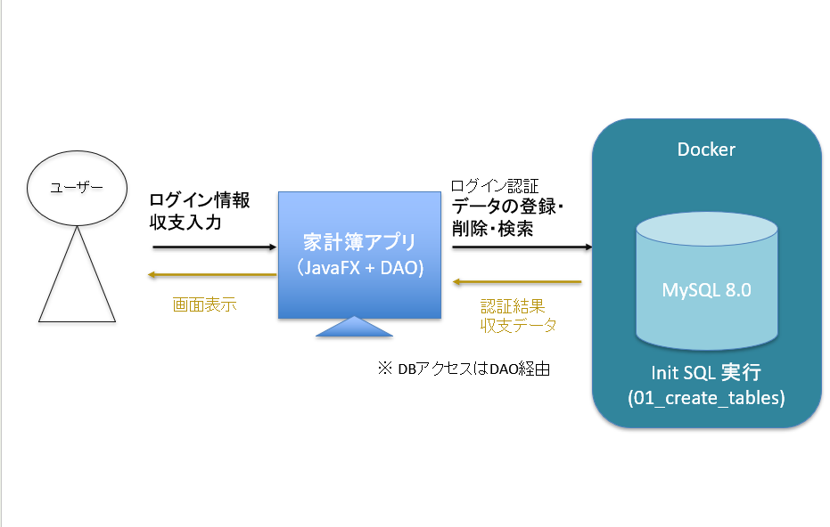
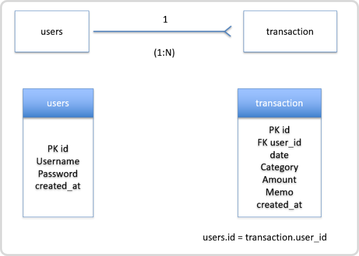
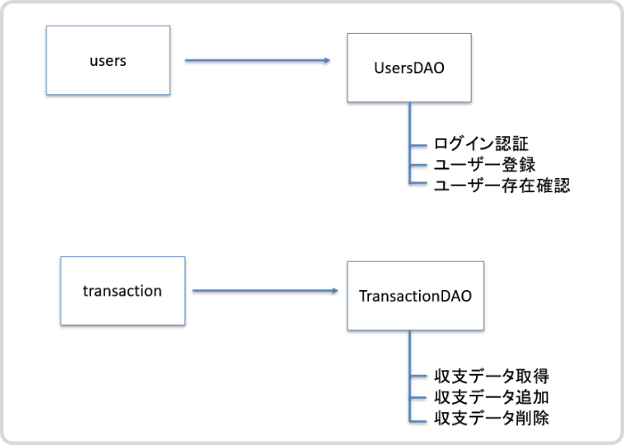
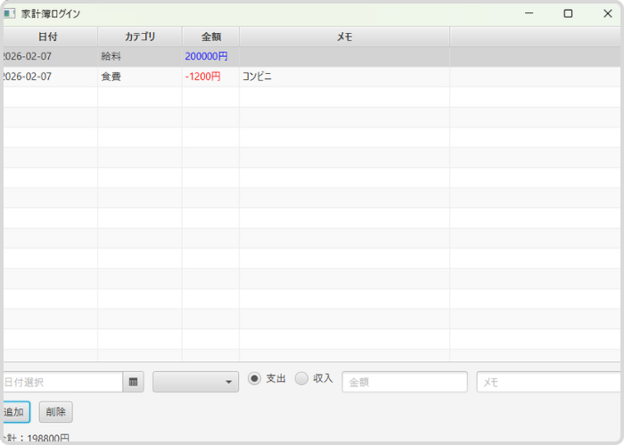

# 家計簿アプリ(JavaFX + MySQL + Docker)

このアプリは、収支の登録・一覧表示・ユーザーごとのデータ管理ができるシンプルな家計簿アプリです。
データベースは Docker 上の MySQL を使用しており、ローカル環境でも簡単にセットアップできます。
---

## 使用技術

* Java 21
* JavaFX 21
* MySQL 8.0(Docker)
* JDBC (MySQL Connector/J)
* dotenv-java（環境変数管理）
* Eclipse / Pleiades
* Docker

※ MySQL Connector/J と dotenv-java は学習目的のため `lib/` 配下に配置しています。  
実務では Maven / Gradle による依存関係管理を想定しています。

---

## 前提環境（重要）
* JDK 21 がインストールされていること  
* Docker Desktop が起動していること
* JavaFX SDK 21 を別途ダウンロードしていること


⚠ **注意**  
Java 11 以降、JavaFX は JDK に同梱されていません。  
本プロジェクトでは JavaFX を module-path 方式で使用します。

## 1. リポジトリをクローン
```bash
git clone https://github.com/Hazuki120/kakeibo.git
cd kakeibo
```

## 2. Docker で MySQL を起動
### 起動
```bash
docker compose up -d
```
### 既存コンテナを再起動
```bash
docker start kakeibo-mysql
```
### 停止
```bash
docker compose down
```

環境変数管理（dotenv-java）
このアプリでは、データベース接続情報をコードに直書きせず、 
dotenv-java（io.github.cdimascio:java-dotenv）を使用して `.env` から安全に読み込んでいます。  

 `.env` はプロジェクトのルートディレクトリに配置します。
 
 `.env` の例  
 
 ```Dotenv
MYSQL_HOST=localhost
MYSQL_PORT=3307
MYSQL_DATABASE=kakeibo
MYSQL_USER=appuser
MYSQL_PASSWORD=apppass
```
JavaFX プロジェクトのため、外部ライブラリ（jar）は  `lib/` 配下に配置し、Eclipse のビルドパスに追加して使用しています。  


MySQL 接続情報   
このアプリでは、データベース接続情報を.envファイルで安全に管理しています。以下は開発用のデフォルト値です。  
| 項目           | 値         |
|----------------|------------|
| ホスト         | localhost  |
| ポート         | 3307       |
| ユーザー名     | appuser    |
| パスワード     | apppass    |
| データベース名 | kakeibo    |

※ 開発用のパスワードです。
※ `docker compose` で作成したコンテナは `docker start kakeibo-mysql` でも再起動可能です。

## 3. データベース構造

本プロジェクトでは `docker-compose.yml` により、
`sql/init/` 配下の SQL ファイルは **MySQL のデータ領域（volume）が空の場合のみ自動実行**されます。 

通常は **手動で SQL を実行する必要はありません**。

### テーブルを再作成したい場合

```bash
docker compose down -v
docker compose up -d
```

※ `-v` オプションを付けると、MySQL のデータ（volume）が全削除されます。  


### 参考：テーブル定義（通常は自動作成）

**users テーブル**  

```sql
CREATE TABLE users (  
	id INT AUTO_INCREMENT PRIMARY KEY,  
	username VARCHAR(50) NOT NULL,  
	password VARCHAR(100) NOT NULL,  
	email VARCHAR(100),  
	created_at TIMESTAMP DEFAULT CURRENT_TIMESTAMP  
) ENGINE=InnoDB;
```
**transactions テーブル**

```sql
CREATE TABLE transactions (
  id INT AUTO_INCREMENT PRIMARY KEY,
  user_id INT NOT NULL,
  date DATE NOT NULL,
  category VARCHAR(50) NOT NULL,
  amount INT NOT NULL,
  memo VARCHAR(255),
  created_at TIMESTAMP DEFAULT CURRENT_TIMESTAMP,
  CONSTRAINT fk_transactions_user
    FOREIGN KEY (user_id) REFERENCES users(id)
) ENGINE=InnoDB;
```
※ `transactions` テーブルは `users` テーブルと外部キー制約で関連付けています。  
※ ユーザごとに家計簿データを管理する想定です。

## 4. アプリの起動方法（Eclipse）
### ① MySQL Connector/J  と dotenv-java をビルドパスに追加
`lib/mysql-connector-j-9.5.0.jar` と `lib/java-dotenv-5.2.2.jar` をビルド・パスに追加（Classpath）

設定手順：
【プロジェクトのプロパティ】→【Java ビルド・パス】→【ライブラリ】→【外部 JAR の追加】

※ この設定を行わない場合、MySQL に接続できません。  

### ② JavaFX を Modulepath に設定

> ❗ **JavaFX の JAR を Classpath に追加しないでください**
> 本プロジェクトでは **Modulepath 方式**を使用します。

1. JavaFX SDK 21 をダウンロードし、任意の場所に展開
   例：`C:\javafx\javafx-sdk-21`
2. 【プロジェクトのプロパティ】→【Java ビルド・パス】→【ライブラリ】
3. 【ライブラリーの追加】→【ユーザー・ライブラリー】
4. 新規作成（名前例：`JavaFX21`）
5. `javafx-sdk-21/lib` 配下の **すべての jar** を追加
6. 追加したライブラリが **`[Modulepath]`** になっていることを確認


### ③ VM引数を設定（重要：JavaFX の警告対策)
Eclipse の実行構成に以下を追加してください。
設定手順：
Main.java → 右クリック → 【実行】 → 【実行の構成】→ 【引数】 →【VM引数】

```text
--module-path "javafx-sdk-21/lib" --add-modules javafx.controls,javafx.fxml
```

※ **必ず絶対パス**を指定してください。  
※ `/C:\...` のような混在パスはエラーになります。  


### ④ アプリを起動
`Main.java` を実行すると、アプリが起動します。
新規登録 → ログイン → 家計簿管理機能を利用できます。

## 5. ログイン方法

1. ログイン画面下部の「新規登録」ボタンを押します。  
2. ユーザー名とパスワードを入力し、登録します。  
3. 「戻る」ボタンでログイン画面に戻ります。  
4. 登録したユーザー名とパスワードを入力し、「ログイン」ボタンを押します。  
5. 家計簿管理画面に遷移します。

## 6. アプリ構成図（DFD / ERD / DAO）

### データフロー図（DFD）
アプリ全体のデータの流れは以下の通りです。  



---


### ER 図（ERD）
ユーザと家計簿データの関係を示した ER 図です。  


---


 
### DAO構造図（DAO Architecture Diagram）

ユーザー情報と家計簿データを扱う DAO クラスの責務を示しています。



 
 ## 7. 画面キャプチャ

### 🔐 ログイン画面
ユーザー名とパスワードを入力してログインします。


---

### 📝 家計簿入力画面（収支登録）
日付・カテゴリ・金額・メモを入力して登録できます。



---


### よくあるエラーと対処

| エラー内容 | 原因 | 対処 |
|-----------|------|------|
| Module javafx.controls not found | JavaFX が Modulepath に設定されていない | JavaFX を Modulepath に追加する |
| Application を解決できません | JavaFX がコンパイル時に見えていない | Classpath ではなく Modulepath を使用する |
| Unsupported JavaFX configuration: classes were loaded from 'unnamed module' | JavaFX が classpath で読み込まれている | module-path を正しく設定する |
| InvalidPathException: Illegal char <:> | `/C:\...` のように不正なパス形式 | `C:\...` の Windows パスに修正 |  


## 今後の課題  
* Maven / Gradle への移行
* 入力バリデーションの強化
* グラフ表示（円グラフ・棒グラフ）
* UI/UX の改善

